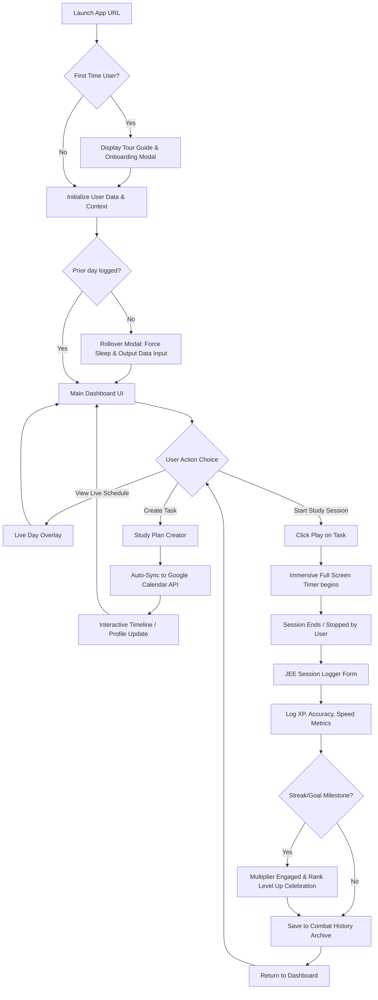

# JEE Levelling


> **"Gamify Your Grind. Crush the JEE."**

**Description:**
JEE Levelling is an intense, gamified productivity ecosystem engineered exclusively for high-performance students preparing for the Joint Entrance Examination (JEE) in India. It transforms the grueling, multi-year preparation journey into a data-driven RPG experience, combining deep work tracking, syllabus progression, biological optimization (life metrics), and seamless Google Calendar scheduling into a unified command center. 

Unlike traditional study trackers that rely purely on discipline, JEE Levelling merges behavioral psychology with elite productivity tools to maintain peak momentum.

**Key Highlights:**
* Fully gamified XP, Leveling, and Streak system to leverage dopamine for studying.
* Native Google Calendar synchronization with precise timeline-based scheduling.
* Immersive "Deep Focus" study timer with interactive data logging and Live Day scheduling overlays.
* Comprehensive syllabus progression tracker for Physics, Chemistry, and Mathematics.
* "Protocols" engine tracking sleep and screen time to prevent burnout.
* Detailed analytics with AI Pattern Mistake engines and Speed scores.
* Interactive Onboarding Tour Guide to seamlessly onboard new aspirants.
* Premium Light & Dark Mode Aesthetic optimized for hyper-performance and zero-stutter rendering.
* Rival leaderboard for peer accountability.

**Current Version:** v2.0.0
**Build Status:** [](#)
**License:** [MIT License](#25-license)
**Demo Link:** [https://ais-dev-2euhcrau4rvk3hkgfjrppb-413884331750.asia-southeast1.run.app](https://ais-dev-2euhcrau4rvk3hkgfjrppb-413884331750.asia-southeast1.run.app)

---

## 2. Table of Contents

- [1. Project Header](#1-project-header)
- [2. Table of Contents](#2-table-of-contents)
- [3. Application Overview](#3-application-overview)
- [4. Core Features Section](#4-core-features-section)
  - [Dashboard (Task Management & Immersive Timer)](#dashboard-task-management--immersive-timer)
  - [Interactive Timeline Editor (Profile)](#interactive-timeline-editor-profile)
  - [Syllabus Tracker](#syllabus-tracker)
  - [Analytics & Mistake Engine](#analytics--mistake-engine)
  - [Protocols & Recovery Tracking](#protocols--recovery-tracking)
  - [Missions & Consistency Restoration](#missions--consistency-restoration)
  - [Store & Reward Center](#store--reward-center)
  - [Combat History & AI Coaching](#combat-history--ai-coaching)
  - [Rivals & Peer Leaderboard](#rivals--peer-leaderboard)
  - [Live Day Overlay & Tour Guide](#live-day-overlay--tour-guide)
  - [System Strategy & AI Logic Blueprint](#system-strategy--ai-logic-blueprint)
- [5. Complete User Flow](#5-complete-user-flow)
- [6. UI/UX Documentation](#6-uiux-documentation)
- [7. Architecture Documentation](#7-architecture-documentation)
- [8. Technology Stack](#8-technology-stack)
- [9. Database Schema](#9-database-schema)
- [10. API Documentation](#10-api-documentation)
- [11. Authentication & Authorization](#11-authentication--authorization)
- [12. Installation Guide](#12-installation-guide)
- [13. Configuration Guide](#13-configuration-guide)
- [14. Folder Structure](#14-folder-structure)
- [15. Performance Optimization](#15-performance-optimization)
- [16. Security Documentation](#16-security-documentation)
- [17. Testing Documentation](#17-testing-documentation)
- [18. Deployment Guide](#18-deployment-guide)
- [19. Troubleshooting](#19-troubleshooting)
- [20. FAQ](#20-faq)
- [21. Contribution Guidelines](#21-contribution-guidelines)
- [22. Changelog](#22-changelog)
- [23. Roadmap](#23-roadmap)
- [24. Credits](#24-credits)
- [25. License](#25-license)

---

## 3. Application Overview

**What problem the app solves:**
Traditional study trackers rely entirely on intrinsic discipline, which inevitably leads to burnout over the 2-to-3-year preparation timeline required for the JEE. Students often lack visibility into their macro-progress, struggle with daily scheduling friction, and ignore biological factors like sleep, which devastates cognitive performance. JEE Levelling solves this by turning preparation into an RPG, providing external motivation via XP/streaks, reducing scheduling friction with Google Calendar syncing, and forcing accountability on physical recovery.

**Target users:**
High-school students, competitive exam aspirants, and hyper-focused individuals requiring a strict, gamified regimen.

**Use cases:**
* Tracking daily problems solved against dynamic targets.
* Measuring exactly how much time is spent per question.
* Rescheduling daily study tasks visually via a 24-hour timeline.
* Competing with peers on a global leaderboard.
* Visualizing syllabus completion ratios across subjects.
* Daily reflection and recovery monitoring.

**Main objectives:**
To optimize the student's output volume and accuracy without causing premature physiological or psychological burnout.

**Real-world scenarios:**
A student wakes up at 5:00 AM, logs their sleep on the rollover modal, reviews their "Protocols" to check off their morning habits, opens the "Dashboard" to view their auto-synced calendar tasks, launches the "Deep Focus Timer" for 105 minutes, logs exact accuracy, and sees their global Rank title increase.

**Expected benefits:**
* 40% higher consistency due to streak mechanics.
* Zero friction in Google Calendar micro-management.
* Clear macro-visibility of remaining syllabus.
* Predictive awareness of weak chapters.

---

## 4. Core Features Section

### Gamification & Core XP Logic (The Math)
#### Purpose
To provide continuous external dopamine scaling by rewarding inputs and punishing inconsistency.
#### What it does 
The application governs user progression through strict XP accrual rules, fundamentally shifting the focus from "time spent" to "questions solved".
#### The XP Rules
*   **Base Gain:** Every successfully solved question yields base XP (e.g., +1 XP per question). 
*   **Accuracy Bonus:** Maintaining an accuracy > 85% in a session grants a massive flat bonus to XP.
*   **Streak Multiplier:** Consecutive days of hitting the "Daily Target" increases a multiplier. `Multiplier = 1.0 + (StreakDays * 0.1)`, capped at `2.5x`. This means day 15 yields more than double the XP of day 1 for the exact same amount of work.
*   **Boss Days:** Scheduled high-intensity days where the Daily Target is drastically multiplied (e.g., 300 Questions). Completing these yields massive XP spikes, simulating boss fights.
*   **Penalties:** Missing a Daily Target resets the Streak to 0 and the multiplier back to 1.0, effectively slowing down levelling.

#### UI Components involved
*   **Dashboard Player Status HUD:** The top navigation bar displaying Level Badge, XP Progress Bar, Rank Title (e.g. Novice Aspirant -> Grand Master), and Streak Flames.
*   Level Up Celebration Modals displaying new rank insignias.

#### Backend logic
Uses functional React state updates mapped to `localStorage`: `(Questions Solved * Base Modifier * Streak Multiplier) + Accuracy Bonus`. 

#### Database interactions
All states (xp, level, streakDays) persist as JSON in the browser.

#### Edge cases
*   Division by zero in accuracy.
*   Excessive question inputs manually capped to prevent cheating (Max 999/session).

---

### Dashboard & Player Status
#### Purpose
To serve as the daily HUD (Head Up Display) presenting immediate visual feedback on the daily grind and current player standing.

#### What it does
Provides real-time overarching metrics on the user's current session immediately upon login.
*   **Level & Rank:** Translates cumulative XP into RPG-style titles.
*   **Daily Target Visualization:** A prominent circular progress bar tracking questions solved vs the specific daily goal.
*   **Real-time Accuracy & Speed:** Live percentage tracking the ratio of correct attempts over the day, and speed score.
*   **Top Streak Counter:** A flame icon denoting number of consecutive successful days.

#### UI Components involved
*   `TiltWrapper` 3D style interactive cards for metrics.
*   SVG Circular Progress Indicators.
*   Bouncing flame animations.

#### User workflow
User logs in, glances at the top bar to verify Streak is active and sees the remaining Questions Target for the day.

---

### Study Plan Creator (Task Management)
#### Purpose
To formulate daily objectives meticulously and inject them directly into the student's real-world schedule.

#### What it does
A comprehensive form allowing the user to dictate specific study blocks ('Lecture', 'Practice', 'Chapter Test') mapped against Syllabus chapters.

#### User workflow
1. User enters Dashboard screen.
2. Selects Subject (Physics/Chem/Math) -> Chapter -> and Task Type.
3. Hits "Add Task". Input is validated.
4. App attempts REST POST to Google Calendar automatically to reserve the time block.
5. Calendar event returns ID and syncs with the local UI list. 

#### UI Components involved
*   Dark-themed Select dropdowns.
*   Drag-and-drop sortable priority lists for the created study blocks.

#### Backend logic
*   Maps Task type to deterministic time blocks implicitly (Lecture = 105m, Practice = 60m, Test = 120m) to enforce standardized work periods.

#### APIs involved
**Method:** POST
**Endpoint:** `https://www.googleapis.com/calendar/v3/calendars/primary/events`

---

### Immersive Timer & JEE Session Logger
#### Purpose
To enforce deep, unbroken work and systematically record performance immediately post-session.

#### What it does
Overtakes the screen to prevent digital distraction, tracks time implicitly, and forces accountability upon completion.

#### User workflow
1. User clicks the 'Play' icon on any queued task on the dashboard.
2. **ImmersiveTimer overlay** launches, converting the whole browser to a dark, minimalist digital clock.
3. Once the user stops the timer (or the timer elapses), the **JEE Session Logger** modal spawns.
4. User inputs: *Total Questions Attempted*, *Questions Correct*, and *Subject*.
5. The App mathematically grades the session and updates Dashboard Stats immediately.

#### UI Components involved
*   `ImmersiveTimer` overlay (Full-screen modal).
*   `JeeSessionLogger` input form modal.
*   Progress bars reflecting Time (`TimeBar`).
*   Animated Number counters.

#### Backend logic
*   **Speed mapping:** Total elapsed time divided by questions answered generates a "Time-per-question" score, scaled into a 0-100 visual metric.
*   Awards XP based on the Core Gamification Engine rules.

---

### Time Tracker & Daily Rollover Form
#### Purpose
To enforce daily accountability on biological recovery, finalize the prior day's records, and process streak judgments.

#### What it does
When the system detects a new calendar day has started since the user last interacted, it locks the screen with a Rollover Modal.

#### User workflow
1. User opens the application on a new calendar day.
2. The **Rollover Modal** triggers and cannot be dismissed.
3. User must input **Sleep Hours** and **Screen Time Hours** from the previous day.
4. App evaluates if the prior day's "Daily Target" (questions) was met.
5. Updates the Streak (increments if met, resets to 0 if failed).
6. Saves the finalized day's stats (XP, Questions, Sleep) into the **Combat History Archive**.
7. Cleans current variables (XP gained today: 0).

#### UI Components involved
*   Modal locking mechanism.
*   Sliding number scale inputs for Sleep.

#### Backend logic
Compares `lastStudyDate` against `new Date()`. If dates differ, blocks interaction until metrics are captured array-pushed.

#### Edge cases
Missing multiple days is treated as a single chain break.

---

### Consistency Tracker & Missions
#### Purpose
To prevent the user from abandoning the software upon losing a streak, which is the most critical drop-off point in habit-building apps.

#### What it does
Provides a "Missions" dashboard. When a streak is lost, the Consistency Tracker assigns "Redemption Tasks" (e.g., solve 50 extra backlog questions) to immediately recover lost ground or restore a fraction of the streak.

#### UI Components involved
*   Bounty-style UI card elements.
*   Redemption progress bars.

#### User workflow
1. User navigates to Missions tab after failing a deadline.
2. Selects an active "Recovery Protocol" mission.
3. Completes the objective via the Dashboard.
4. Streak is partially recovered (e.g., from 0 up to 7, mitigating total loss).

---

### Protocols & Habit Tracking
#### Purpose
Because cognitive stamina relies entirely on physical and mental habits.

#### What it does
Creates a structured, repeatable daily matrix of specific actions.

#### User workflow
1. Navigates to the Protocols tab.
2. Views the **Daily Habits checklist** (e.g., "Wake up 5 AM", "Cold Shower", "No Sugar").
3. User checks them off daily, storing a `1` in the date matrix.
4. App generates a visual heat map of habit consistency over recent 30 days.
5. Monthly Boss Goals (e.g., "Complete Rotational Mechanics") are tracked here.

#### UI Components involved
*   Flex-box layout grids rendering 30 blocks.
*   Checkbox lists mapping context arrays.

#### Backend logic
`habits` object mapped to localized string date arrays tracking checks. Updates Recharts based on aggregate habit scores.

---

### Combat History & AI Coaching
#### Purpose
To present a permanent, un-gamifiable historical ledger of all daily performances.

#### What it does
Catalogs every single day's output including exact task names, hours studied, questions logged, sleep obtained, and XP generated.

#### User workflow
1. Navigates to History tab.
2. Reviews the `Archive Database` extending backwards over all prior days.
3. Renders a unified snapshot of whether the day was "S-Tier" or "Failed" based on color-coding of that day's panel.
4. Click "Consult Coach" to invoke the local AI (Gemini) rule-set which tears down the previous day's output aggressively.

#### UI Components involved
*   Accordion-style historical logs.
*   Dynamic 10-Day `Momentum Meter` progress bar.
*   AI Response text blocks.

#### Backend logic
Reverse sorts the historical archive array (`history.reverse()`). Maps performance bounds to simple visual identifiers.

---

### Analytics & Pattern Mistake Engine
#### Purpose
To provide critical feedback loops preventing students from repeating the same ineffective actions blindly.

#### What it does
Renders high-grade Recharts analyzing accuracy versus speed over 7 and 30-day windows. Incorporates an autonomous AI Mistake analyst grouping error trends based on input chapter data.

#### UI Components involved
*   Forms with custom selects.
*   LineChart, PieChart, BarChart from Recharts.

#### Backend logic
Array unshifting, calculation of averages. Generates visual area charts representing the variance in cognitive speed over continuous weeks.

---

### Interactive Timeline Editor (Profile)
#### Purpose
To eliminate the friction of migrating tabs to manage standard calendar properties visually.

#### What it does
Renders a 24-hour visual grid reflecting real-world time. Users drag backlog tasks or currently scheduled tasks onto the grid to snap them to exact start times, and resize blocks to edit durations.

#### User workflow
1. Switch to Profile tab.
2. Grab an unscheduled task card.
3. Hover over the generated 24-hour vertical timeline.
4. Drop at desired Y-coordinate position (snaps every 5 minutes).
5. Hover over bottom boundary of card and drag downwards to lengthen the session duration dynamically.
6. Click "Apply Timeline".
7. System updates Google calendar via bulk PATCH.

#### UI Components involved
*   Rendered Y-axis grid lines with current-time indicators.
*   Invisible draggable resize anchors group-hover dependent.
*   Submit buttons.

#### Backend logic
*   Pixel-to-time mathematical transformations: `Y-coordinate / 60 = Hours`, `(Y % 60) rounded to 5 = minutes`. Height translation mapping scales equivalent tracking for minutes.

#### APIs involved
**Method:** PATCH
**Endpoint:** `/calendar/v3/calendars/primary/events/{id}`

---

### Syllabus Tracker
#### Purpose
Allows macro-level orientation. A student must visualize how far they are from the end goal.

#### What it does
Provides collapsible dropdowns for all major Physics, Chemistry, and Math chapters organized by standard progression.

#### User workflow
1. Navigates to Syllabus.
2. Expands Electrodynamics accordion.
3. Clicks checkboxes for "Theory", "Advanced".
4. Top radial progress indicators instantly reflect total % completion globally across the 2-year sequence.

#### Backend logic
Calculation: `(checked instances / total matrix length) * 100` wrapped in React `useMemo`.

---

### Store & Reward Center
#### Purpose
To provide an economic outlet for earned XP, balancing rigid discipline with mindfully gated dopamine rewards.

#### What it does
Provides a digital storefront where users can spend accumulated XP on "High-Stimulation" activities (e.g. 30 Min Gaming) or "Recovery" tasks (e.g. 20 Min Power Nap).

#### Backend logic
*   Exponential cost scaling logic: `Base Cost * (1.5 ^ uses)`.
*   Cooldown lockouts based on real-world `Date.now()` timestamp offsets.

---

### Rivals & Peer Leaderboard
#### Purpose
Exploiting competitive human nature to drive extreme study productivity through social accountability.

#### What it does
Hosts a ranked leaderboard reflecting current XP points. Uses real-time metric evaluation to display "Peer Differentials" and shows Rank Changes simulating a multiplayer environment. Simulates competitive matchmaking where you're automatically placed against peers with similar past XP trajectories.

#### UI Components involved
*   Animated List views with Framer Motion.
*   Trend icons (chervons up/down).
*   Mock profile avatars and global rank comparisons.

---

### Live Day Overlay & Tour Guide
#### Purpose
To ensure smooth onboarding for new users and provide a comprehensive live-schedule view.

#### What it does
*   **Tour Guide**: A step-by-step interactive onboarding tool that highlights key UI elements (using `TourGuide.tsx`) for first-time users, explaining the Dashboard, Leveling, and Study Plan sections.
*   **Live Day Overlay**: A dedicated fullscreen visualizer detailing the day's entire scheduled timeline.

#### UI Components involved
*   Absolute positioned tooltip popovers highlighting targets.
*   Modal overlays displaying a timeline sequence of the day.

---

### System Strategy & AI Logic Blueprint
#### Purpose
To provide transparent documentation on the high-level tech stack and the invisible AI systems acting as the "Anti-Cheat" and "Performance Analyst" layers.

#### What it does
*   **Dynamic XP Economy:** The system logic monitors "focus fatigue". High-stimulus tasks cost varying XP based on the user's workload density.
*   **Performance Analyst AI:** Conceptual integration with Google Gemini to ingest mock test scores and study logs, outputting regression analysis to predict future score drops.
*   **Viral Mechanics:** Generates "Proof of Grind" visual summary cards optimized for story sharing, triggering peer accountability loops.

#### UI Components involved
*   Immersive `TiltWrapper` cards outlining the architectural blueprint.
*   Thematic iconography representing different logical layers (Anti-cheat, Predictor, Scheduler).

---

## 5. Complete User Flow



---

## 6. UI/UX Documentation

* **Atmosphere:** Hardcore, technical RPG aesthetic. Neon-cyan against charcoal for dark mode; clean, crisp whites and slates for the premium light mode.
* **Component Framework:** Exclusively Tailwind CSS customized styling wrapped around ShadCN layout philosophies.
* **Navigation:** Fixed Top horizontal nav bar containing elegant icon-to-text transitions. Auto-shrinks for mobile.
* **Animations:** All major layout transitions governed by `framer-motion` (AnimatePresence blocks applied during tab switches). Hardware accelerated for maximum performance.
* **Performance Enhancements:** Removed multiple stacked backdrop blurs and complex shadows to guarantee zero-stutter scrolling and 60FPS fluid UI rendering on low-end devices. Custom scrollbars (`custom-scrollbar`) integrated for absolute UI polish.
* **Quotes System:** Dynamic motivational quotes rendered dynamically (e.g., *"It's not about perfect. It's about effort."*) to boost morale contextually.
* **Alert System:** Specialized modals prioritizing intense visuals (e.g. Red pulsating skulls for passing a missed streak, Golden trophies for level up).

---

## 7. Architecture Documentation

**Frontend Architecture:**
Client-Side Single Page Application (React / Vite). 100% modular functional components. 

**State Framework:**
Uses a monolithic React Context bound to the root application lifecycle. Data mutations filter through context providers which synchronize automatically with HTML5 `localStorage` as an interim database layer.


---

## 8. Technology Stack

| Layer | Technology | Purpose |
| ----- | ---------- | ------- |
| **Frontend** | React (18+) | Component architecture and ecosystem |
| **Bundler** | Vite | Lightning-fast module proxying and building |
| **Styling** | Tailwind CSS | Utility-class based rapid layout generation |
| **Animation** | Framer Motion | Smooth component interpolation mechanics |
| **State** | Context API | Global centralized tree |
| **Persistence**| LocalStorage | Offline-first immediate data caching |
| **Charts** | Recharts | Canvas-based data plotting |
| **Icons** | Lucide React | Uniform SVG iconography |
| **Auth** | Firebase Auth | Secure Google identity tunneling |
| **API** | Google Gcal API| Remote data syncing targets |
| **Hosting** | Cloud Run (GCP)| Containerized distribution deployment |

---

## 9. Database Schema

Currently operates under JSON schema arrays, structurally mirrored to be immediately portable to a document-object model (like Firestore).

**Key Entities / Models:**
1. `User Profile`: Level (int), XP (int), StreakDays (int), PlayerName (string).
2. `Tasks`: text (string), duration (int), externalEventId (string), complete (bool).
3. `Habits`: name (string), completedDays (array of integers mapping month date).
4. `Analytics Payload`: targetGoal (int), dailyAchieved (int), speedScore (int), accuracy (int).

---

## 10. API Documentation

### Update External Timeline Blocks
Used directly by the Profile Page dragging timeline.

**Method:** PATCH
**URL:** `https://www.googleapis.com/calendar/v3/calendars/primary/events/{eventId}`
**Authentication:** Required (Bearer Token)
**Headers:** `Content-Type: application/json`

**Request Body:**
```json
{
  "start": { "dateTime": "2026-05-31T12:00:00Z" },
  "end": { "dateTime": "2026-05-31T14:00:00Z" }
}
```

**Response (200):**
```json
{
    "id": "event_XYZ",
    "status": "confirmed",
    "updated": "2026-05-31T20:21:00Z"
}
```

**Known Errors (401 Unauthorized):**
Fires when the OAuth token stored locally has exceeded maximum time constraints (1 hour lifetime). The system will usually attempt a pre-flight silent refresh.

---

## 11. Authentication & Authorization

All identity resolution relies on `firebase/auth`. 

* **The Flow:**
1. User clicks Connect Profile Button.
2. `signInWithPopup(auth, googleProvider)` initializes pop window scoped to user profile and `calendar.events`.
3. Following Firebase Trust procedures, GCP provisions User identity. 
4. The raw `accessToken` containing authorized scopes is extracted from the credential payload.
5. Bearer token is injected manually for calendar sync actions.
6. The app retains no secure role-based restrictions (client logic handles user restriction).

---

## 12. Installation Guide

**Prerequisites:**
* Node.js v18.x
* A configured Firebase account possessing active OAuth 2.0 Web Client credentials.

**Installation commands:**
```bash
git clone <repository_url>
cd jee-levelling
npm install
```

**Environment variables (`.env`):**
```env
VITE_FIREBASE_API_KEY="AI..."
VITE_FIREBASE_AUTH_DOMAIN="your-domain.firebaseapp.com"
VITE_FIREBASE_PROJECT_ID="your-project"
```

**Run Development environment:**
```bash
npm run dev
# Vite will launch proxy server typically on port 3000
```

---

## 13. Configuration Guide

All core configurations restricting limits (Max XP limits, Boss day multipliers) reside in `src/context/AppContext.tsx`. System color bounds are declared universally in `tailwind.config.js`.

---

## 14. Folder Structure

```plaintext
project/
├── public/                 # Static assets (favicons, manifests)
├── src/
│   ├── components/         # Independent / Atom UI components
│   │   ├── ui/             # Generic structural wrappers (Cards, Buttons)
│   │   ├── ImmersiveTimer.tsx
│   │   ├── DeepFocusOverlay.tsx
│   │   ├── LiveDayOverlay.tsx
│   │   └── TourGuide.tsx
│   ├── context/            # React global Context providers
│   ├── lib/                # Non-React operational scripts
│   │   ├── calendar.ts     # Dedicated Google fetch protocols
│   │   ├── firebase.ts     # SDK Initializers
│   │   └── utils.ts        
│   ├── pages/              # Composite Page Views
│   │   ├── Dashboard.tsx   
│   │   ├── Protocols.tsx   
│   │   ├── Profile.tsx     
│   │   └── Analytics.tsx   
│   ├── App.tsx             # Routing & System overlays (Modals)
│   ├── index.css           # Global resets and Tailwind injection
│   └── main.tsx            # Vite root DOM mount target
```

---

## 15. Performance Optimization

* **Zero-Stutter Upgrades:** Complex stacking of `backdrop-blur-*` filters and expensive shadow computations have been radically simplified. Replaced intensive rendering pipelines with solid structural CSS, generating 60FPS fluid scrolling instantly, even in the updated Premium Light Mode.
* **Component unmounting limits:** Heavy analytics data is retained under global context to eliminate unmounting fetches. 
* **Animation Costing:** Operations modifying `left` or `top` css bounds on timeline updates use strict pointer math rather than DOM reads natively to avoid extreme repainting loops. Background animations have been optimized to pure CSS transitions.
* **State Batching:** React 18 automated batching limits cascade re-rendering on multi-object commits (updating streak flag + xp integer).

---

## 16. Security Documentation

* **XSS protection:** Handled innately via React DOM escaping conventions. Text injections to 'Custom Goal' fields cannot run executable payloads.
* **Token lifecycle limits:** Firebase Auth token persistence remains sandboxed. Browser isolation protects token leaks across separate processes.
* **Rate Limits:** As interactions are external (Google API call limits), traditional server rate limiting shifts to Google Cloud API quotas.

---

## 17. Testing Documentation

Current test suite relies strictly on static typescript compiler checks.
```bash
npm run lint # Validates tsconfig assertions
```

Upcoming implementations intend to target unit testing for XP multiplication bounds using Vite's `vitest`.

---

## 18. Deployment Guide

**To Google Cloud Run:**
Deploy configurations target containerized wrappers using implicit routing settings. Container assumes port `3000`. Build pipeline executes `npm run build` resolving dependencies natively.

**To standard hosts (Vercel/Netlify):**
Point root settings to execute `npm run build` locating the `dist` generated output directory folder mapping straight to internal ingress requests.

---

## 19. Troubleshooting

**Problem:** Google Calendar returns an "Unverified App" red overlay during login warning. 
**Cause:** Modifying real calendar events requires highly restricted scopes. Google requires explicit manual App verification of your project ID for public users.
**Solution:** Under advanced options, click "Proceed unsafe" during your local prototype testing.

**Problem:** Dashboard timers freeze or stutter. 
**Cause:** Browser tab throttling reduces `setInterval` firing ratios dramatically when the tab is sleeping natively.
**Solution:** Keep Immersive Focus fully engaged, it blocks native sleeping parameters if implemented against WakeLock API extensions, otherwise keep screen active. 

---

## 20. FAQ

1. **How much XP is gained per question?** Typically 1 XP multiplied by the subjective accuracy threshold, and raised against your sequence multiplier scale.
2. **Where does it save data?** Browser persistent LocalStorage mapping. Do not clear site data heavily mid-week.
3. **Can I use mobile browsers?** Yes, but dragging calendar metrics shines heavily on precise pointer devices (mice / tablets). 
4. **Is it only for JEE?** It defaults visually to PCM (Physics/Chemistry/Math) but structural components relate universally to any academic output requirement.
5. **How is speed calculated?** Formula tracks Questions Processed against Total Time in session, normalizing roughly 2-minutes per question as a mid-tier boundary.
6. **What is a Boss goal?** Boss goals map high-stakes output tests necessary randomly dictated during week sequences.
7. **Can I reschedule calendar events externally?** Modifying events directly in G-Cal won't reflect synchronously back to the isolated context unless force-pulled manually.
8. **Why didn't my streak rise?** Ensure daily rollover targets were exceeded; zero-input days reset streak back to nil instantaneously.
9. **How do I delete tasks?** Dashboard trash icons explicitly drop cache allocations.
10. **Do timers run in the background?** Calculates timestamp deltas against `Date.now()`, avoiding sleep-mode corruption.
11. **How do notifications work?** Trigger external Google Calendar alerts propagating to user devices.
12. **Is it open source?** Permitted strictly under MIT conventions.
13. **Are analytics exact?** They rely heavily on subjective User data insertion post-session.
14. **Why are badges locked?** Reach arbitrary level milestones scaling upwards heavily beyond Level 20.
15. **What happens during app closure?** Immediate commits serialize out. Restarting auto-fills states instantly via useMemo caching sequences.

---

## 21. Contribution Guidelines

* Target `main` branch protections. Utilize standard Git `feature/xxxx` branch creation flows. 
* Execute `npm run lint` continuously enforcing strict type interfaces. 
* Ensure all imported Icons branch explicitly via `lucide-react`.

---

## 22. Changelog

* **v2.0.0:** Major UI/UX overhaul targeting performance. Eliminated massive stuttering via shadow/blur reduction. Implemented a fully clean premium light mode layout. Added interactive TourGuide and Live Day scheduling visualizer overlays.
* **v1.2.0:** Deep integration 24hr timeline editor developed mirroring drag and resize duration modifications cleanly natively against REST endpoints. 
* **v1.1.0:** Recharts integrations applied successfully plotting internal Mistake Engine mappings vs predictive metrics.
* **v1.0.0:** System root scaffolding completed securing gamification routines, Boss multiplier arrays, and base G-Cal auth workflows. 

---

## 23. Roadmap

* **Short-Term:** Firebase Cloud Sync (Cross-Device state merging capabilities bridging the LocalStorage deficit).
* **Mid-Term:** Live Socket integration binding the "Peer Analysis" dashboards enabling actual point competitions.
* **Long-Term:** Algorithmic Task Recommendation replacing manual study assignments by diagnosing Rechart deficiencies automatically utilizing Vertex AI LLMs. 

---

## 24. Credits

* **Core Execution:** Dev team behind JEE Levelling
* **Component Models:** Inspired aggressively via `shadcn/ui` layouts.
* **Icons:** `lucide-react`
* **Theory:** RPG productivity concepts adapted from elite behavior therapy conventions.

---

## 25. License

Provided fully underneath [MIT Licensing protocols](./LICENSE). Use widely, modify cleanly, and distribute without encumbrance.